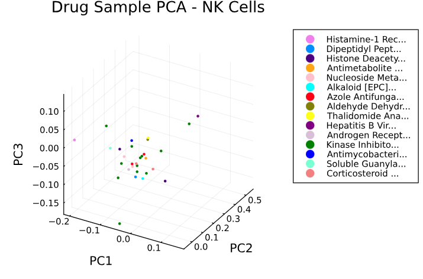
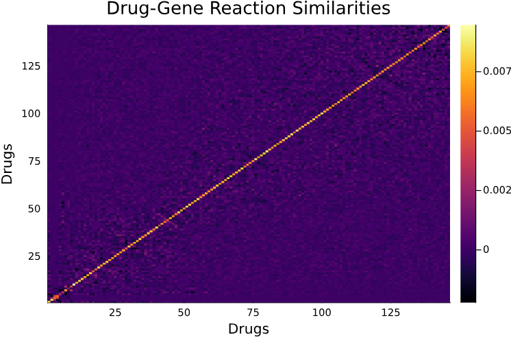

<h1>21-241 Final Project: Analyzing Drug Response Using PCA</h1>
By Sarah Cross and Aashna Kulshrestha

<h2>Overview</h2>
Analyzing and predicting how small molecules change gene expression across different cell types is a remarkably complex problem that is extremely important in the field of drug discovery, as new medicines are typically costly and extremely expensive to develop. If able to accurately predict how a small molecule upregulates or downregulates a set of genes, therapeutics could be developed to target genes known to be associated with specific illnesses entirely computationally, significantly accelerating and expending the development of new medicines.

This project, using classic Linear Algebra techniques, attempts to divulge certain insights into the mechanisms and patterns found in drug perturbation, looking in particular at how to reduce down the dimensionality of differential gene expression using PCA in order to observe patterns amongst similar drugs. Additionally, by obtaining the principal components of a set of 18,211 genes, this may serve as a better input for a model predicting drug perturbation, as models being trained on relatively few samples (634 samples, in this case) with many inputs (18,211 genes) are likely to be subjected to extreme overfitting (eg. the models have enough parameters that they can "remember" the exact points given during training, and retain high accuracy during training while receiving extremely low accuracy when exposed to new data).

<h2>Background</h2>
This project uses a dataset developed by Open Problems in Single-Cell Analysis, containing single-cell gene expression profiles (with 18,211 genes) taken from human peripheral blood mononuclear cells (PBMCs). The cells were treated with 144 compounds, then gene expression was measured and post-processed.

The researchers stipulated that PCA was likely to perform well on this particular problem, as many genes are co-regulated. This can happen for a variety of reasons; for example, genes may be grouped into the same operon and may be transcribed into proteins together, or may be part of the same metabolic pathway and coregulate one another. As a result, it is likely that there are not 18,211 genes that are changing completely independently of one another, and that many are linearly dependent on one another, making principal component analysis a viable pre-processing technique for this dataset in particular.

<h2>Graphs and Results</h2>

The graphs above displays the first three principal components of drug samples with pharmacological classifications (EPC) available in the OpenFDA Drug database and cross-referenced with the National Drug Codes List, filtered by the type of cell (as different types of cells may respond very differently to the same type of drug, the researchers opted to analyze cell types separately, focusing on NK cells in particular). Ultimately it was found that there was a relatively weak correlation between drugs of the same pharmacological class, indicating that, although the drugs perform in the same way, they do not necessarily modify similar genes (however, only around 20 drugs had a corresponding EPC, which is likely not enough data to form a strong conclusion).

For NK Cells, the following information was found (in which standard deviation measures how different, on average, the gene expression data was across the drugs tested in that particular drug class):

Drug Class | Standard Deviation
---|---
His-1 Receptor Antagonist | 0.475053
Dipeptidyl Peptidase 4 Inhibitor | 0.738885
Histone Deacetylase Inhibitor | 0.868306
Antimetabolite | 0.900148
Nucleoside Metabolic Inhibitor | 1.317649
Alkaloid | 0.660692
Azole Antifungal | 0.612870
Aldehyde Dehydrogenase Inhibitor | 2.026750
Thalidomide Analog | 0.790018
Hepatitis B Virus Nucleoside Analog Reverse Transcriptase Inhibitor | 1.174471
Kinase Inhibitor | 1.041723
Androgen Receptor Inhibitor | 0.727339
Antimycobacterial | 0.919412
Soluble Guanylate Cyclase Stimulator | 0.476024

Excluding Azoles and Aldehyde drugs, the following appears to indicate that drugs within the same classification generally will result in similar gene expression profiles compared to how similar they are compared to drugs of all classes.

The graph above displays the covariance matrix for each drug and how similarly genes respond to perturbation. Lighter colors indicate that the drugs share similar differential gene expression data (the diagonal displays values of 1 because a drug will share 100\% similarity with itself). From the data given, the covariance matrix displayed that the Vandetanib and Idelalisib drugs had the most similar gene expression profiles; this corroborates with existing information about both molecules, as both are anti-cancer drugs, kinase inhibitors, and both have a two-ring carbon, as well as 7 Hydrogen bond acceptor locations.

It was additionally found that a rank **100** matrix was able to form the original matrix with 99.5\% accuracy, compared to the original 18,211 genes given, indicating that many genes can be represented as linear combinations of one another, and that the data can be significantly summarized down to enable more efficient analysis and effective ML model training.
